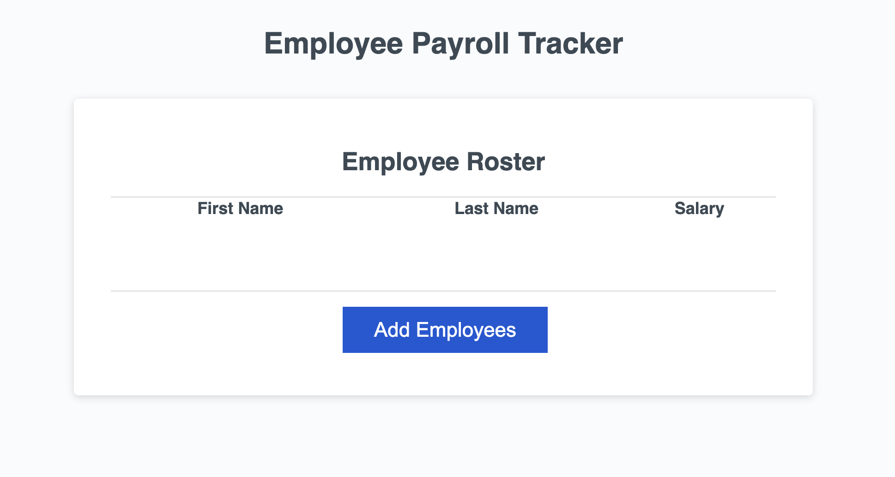

# employee_tracker

## Description

This is an employee payroll tracker designed to help businesses gather employee data (name, income), in an organized, concise way.

- Help businesses organize data.
- Optimizing overall effectiveness.

## Example

## Links

For access to deployed website [Click Here](https://parryprogramming.github.io/employee_tracker/)
